# Modul 5 : Java *Profiling*

Nama : Muhammad Mariozulfandy \
NPM : 2206041404 \
Kelas : C

#### 1. What is the difference between the approach of performance testing with JMeter and profiling with IntelliJ Profiler in the context of optimizing application performance?
Pengujian kinerja dengan JMeter bertujuan untuk mengukur bagaimana aplikasi berperforma di bawah berbagai kondisi beban, sedangkan profilisasi dengan IntelliJ Profiler digunakan untuk mengidentifikasi masalah kinerja pada tingkat kode yang lebih dalam. JMeter fokus pada mengevaluasi respons keseluruhan sistem, sementara Profiler IntelliJ lebih menitikberatkan pada pengumpulan data runtime seperti penggunaan memori, penggunaan CPU, dan waktu eksekusi metode. JMeter menghasilkan informasi tentang respons aplikasi di bawah beban, sementara Profiler IntelliJ memberikan wawasan detail tentang bagaimana aplikasi berperilaku secara internal.
#### 2. How does the profiling process help you in identifying and understanding the weak points in your application?
Proses profilisasi membantu  mengidentifikasi dan memahami titik lemah dalam aplikasi dengan mengumpulkan data runtime seperti penggunaan memori, penggunaan CPU, dan waktu eksekusi metode. Informasi ini memungkinkan  untuk melacak bagian kode yang memakan waktu atau menggunakan sumber daya secara berlebihan. Dengan demikian,  dapat fokus pada memperbaiki area-area tersebut untuk meningkatkan kinerja keseluruhan aplikasi.
#### 3. Do you think IntelliJ Profiler is effective in assisting you to analyze and identify bottlenecks in your application code?
Ya, Profiler IntelliJ efektif dalam membantu menganalisis dan mengidentifikasi bottleneck dalam kode aplikasi. Dengan menyediakan data runtime yang detail seperti penggunaan memori, penggunaan CPU, dan waktu eksekusi metode, Profiler IntelliJ memungkinkan pengembang untuk melacak dan memahami bagian-bagian kode yang memerlukan perbaikan untuk meningkatkan kinerja aplikasi secara keseluruhan.
#### 4. What are the main challenges you face when conducting performance testing and profiling, and how do you overcome these challenges?
Tantangan utama dalam pengujian kinerja dan profilisasi adalah kompleksitas aplikasi, overhead, interpretasi data, dan penemuan masalah yang tidak terduga. Untuk mengatasinya, perlunya pemantauan terus-menerus, penggunaan alat bantu seperti JMeter dan Profiler IntelliJ, kolaborasi tim, dan pemahaman mendalam tentang aplikasi.
#### 5. What are the main benefits you gain from using IntelliJ Profiler for profiling your application code?
Manfaat utama yang didapat dari menggunakan Profiler IntelliJ untuk profilisasi kode aplikasi adalah:
- Identifikasi masalah kinerja secara detail seperti penggunaan memori, penggunaan CPU, dan waktu eksekusi metode.
- Pemahaman mendalam tentang bagaimana aplikasi berperilaku secara internal.
- Pengoptimalan kode yang lebih efisien untuk meningkatkan kinerja keseluruhan aplikasi.
#### 6. How do you handle situations where the results from profiling with IntelliJ Profiler are not entirely consistent with findings from performance testing using JMeter?
Dalam situasi di mana hasil profilisasi dengan Profiler IntelliJ tidak sepenuhnya sesuai dengan temuan dari pengujian kinerja menggunakan JMeter, langkah-langkahnya termasuk menganalisis perbedaan, berkolaborasi dengan tim, melakukan pengujian tambahan, dan menyesuaikan strategi.
#### 7. What strategies do you implement in optimizing application code after analyzing results from performance testing and profiling? How do you ensure the changes you make do not affect the application's functionality?
Setelah menganalisis hasil dari pengujian kinerja dan profilisasi, strategi yang dapat diimplementasikan dalam mengoptimalkan kode aplikasi meliputi:
- Identifikasi area yang memerlukan perbaikan berdasarkan temuan dari pengujian kinerja dan profilisasi.
- Menerapkan perubahan kode untuk mengoptimalkan area-area yang teridentifikasi.
- Melakukan pengujian regresi untuk memastikan bahwa perubahan yang dibuat tidak memengaruhi fungsionalitas aplikasi.
- Memantau kinerja aplikasi setelah perubahan dilakukan untuk memverifikasi peningkatan yang diharapkan dan memastikan tidak ada dampak negatif terhadap fungsionalitas.

### JMeter Performance Testing Result
#### `all-student` endpoint
- JMeter GUI result (Before optimization)
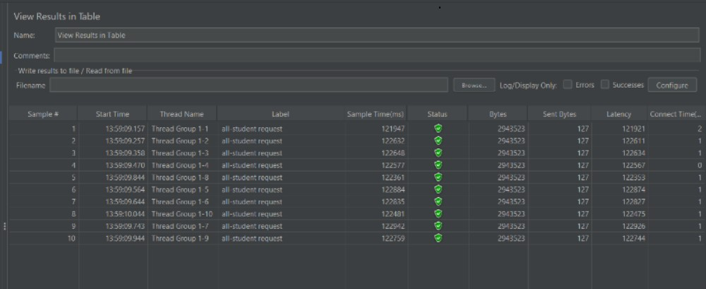
- JMeter GUI result (After optimization)
  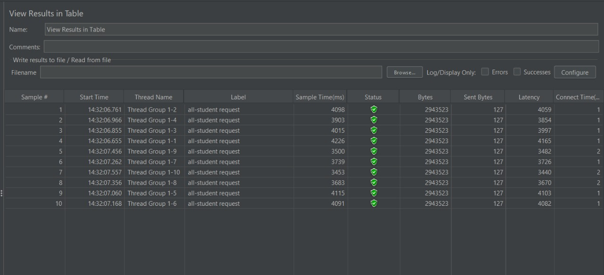
- JMeter Command Line result (Before optimization)
  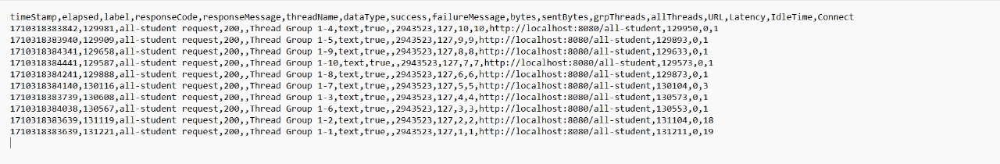
- JMeter Command Line result (After optimization)
  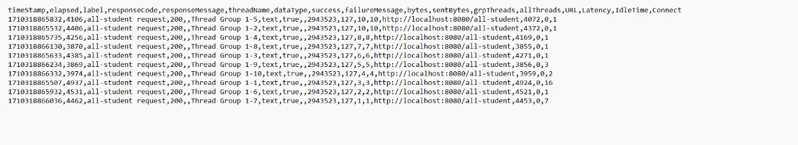

#### `all-student-name` endpoint
- JMeter GUI result (Before optimization)
  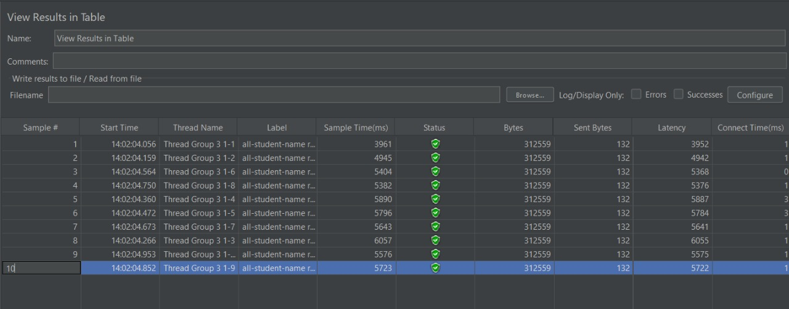
- JMeter GUI result (After optimization)
  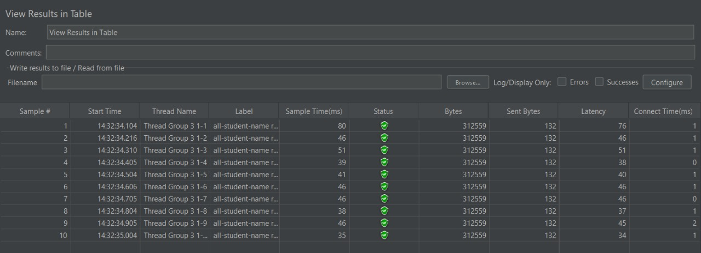
- JMeter Command Line result (Before optimization)
  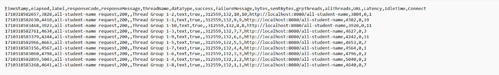
- JMeter Command Line result (After optimization)
  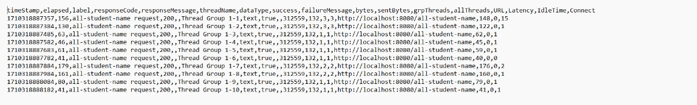

#### `highest-gpa` endpoint
- JMeter GUI result (Before optimization)
  
- JMeter GUI result (After optimization)
  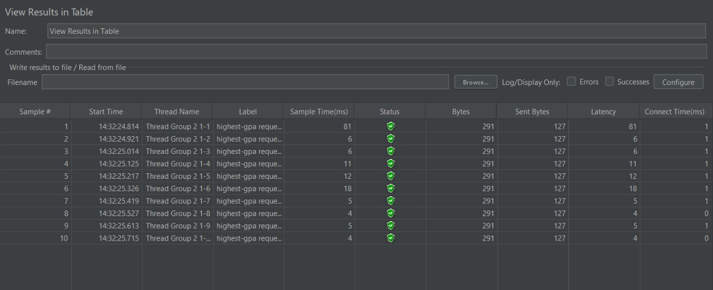
- JMeter Command Line Result (Before optimization)
  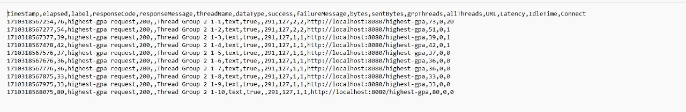
- JMeter Command Line result (After optimization)
  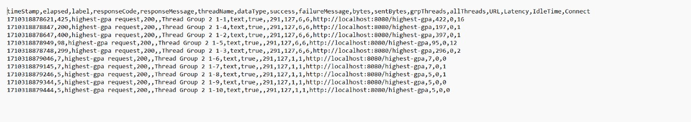

#### Kesimpulan
Menurut informasi yang diberikan, hasil kinerja setelah proses optimalisasi jauh lebih baik daripada sebelumnya. Perbaikan ini dapat dilihat dari perbandingan gambar yang ditampilkan baik pada pengujian melalui antarmuka grafis (GUI) maupun melalui baris perintah (Command Line). Waktu yang dibutuhkan untuk mengeksekusi aplikasi setelah dilakukan optimalisasi juga tercatat lebih singkat dibandingkan sebelumnya.